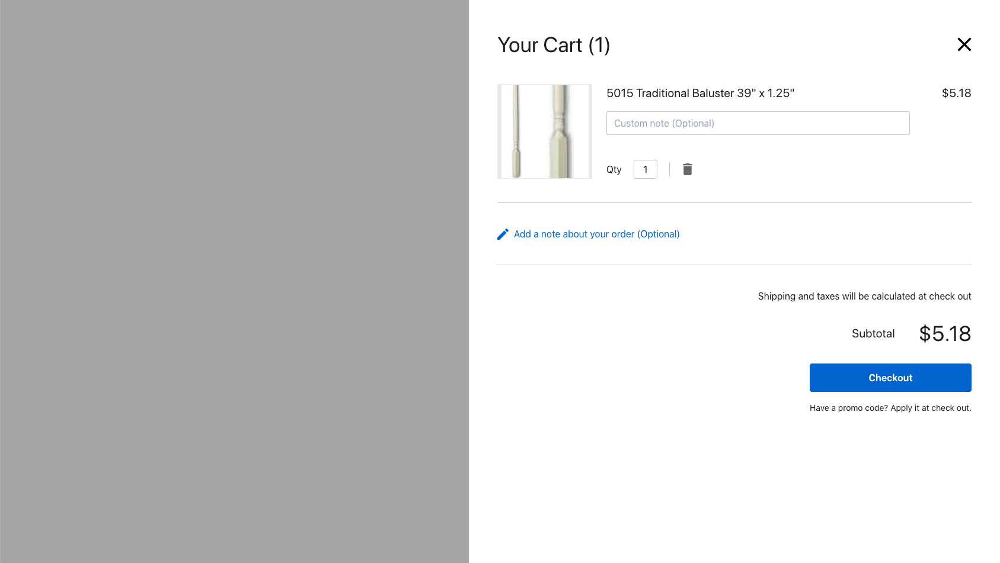

# Components

## R64Cart



R64Cart allows us to see current cart items with items subtotal. We can edit their quantity and leave note for each of them or for the whole cart. From here we can either close the cart (X) or transition to [Checkout](/components#checkout).

### Example

```html
<R64Cart @cart:update="updateCart" />
```

When `R64Cart` component is [mounted](https://vuejs.org/v2/api/#mounted) new cart is automatically created for us and is passed to parent with `@cart:update` event. If you want to re-use cart that has already been created, you can pass in `cart-token` using props.

```html
<R64Cart
  :cart-token="cartToken"
  @cart:update="updateCart"
/>
```

### Events
| Event | Payload           | Description |
| ----- | ----------------- | ----- |
| cart:update | cart object | Triggered for every cart update|
| close       |      -      | Triggered on cart close (X) |
| checkout    |      -      | Triggered when clicking on Checkout button |

### Props
| Property        | Type    | Default value |
| --------------- | ------- | ------------- |
| cart-token      | String  | null          |
| currency-symbol | String  | $             |

In addition `R64Cart` component also accepts [Theme props](/theme).

### Real world example
This example outlines how to use `R64Cart` component and `cartApi` with [localStorage](https://developer.mozilla.org/en-US/docs/Web/API/Window/localStorage).

```vue
<template>
  <R64Cart
    v-if="cart"
    :cart-token="cartToken"
    @cart:update="updateCart"
  />
</template>

<script>
import { R64Cart, cartApi } from '@64robots/checkout-vue'

export default {
  data() {
    return {
      cart: null,
    }
  },

  computed: {
    cartToken() {
      return this.cart && this.cart.cart_token
    },
  },
  
  async mounted() {
    const cartToken = window.localStorage.getItem('cart_token')

    try {
      if (!cartToken) {
        const { data } = await cartApi.create()
        window.localStorage.setItem('cart_token', data.cart_token)
        this.cart = data
      } else {
        const { data } = await cartApi.get(cartToken)
        this.cart = data
      }
    } catch (e) {
      //
    }
  },

  methods: {
    updateCart(cart) {
      // 
      this.cart = cart
    }
  },
}
</script>
```