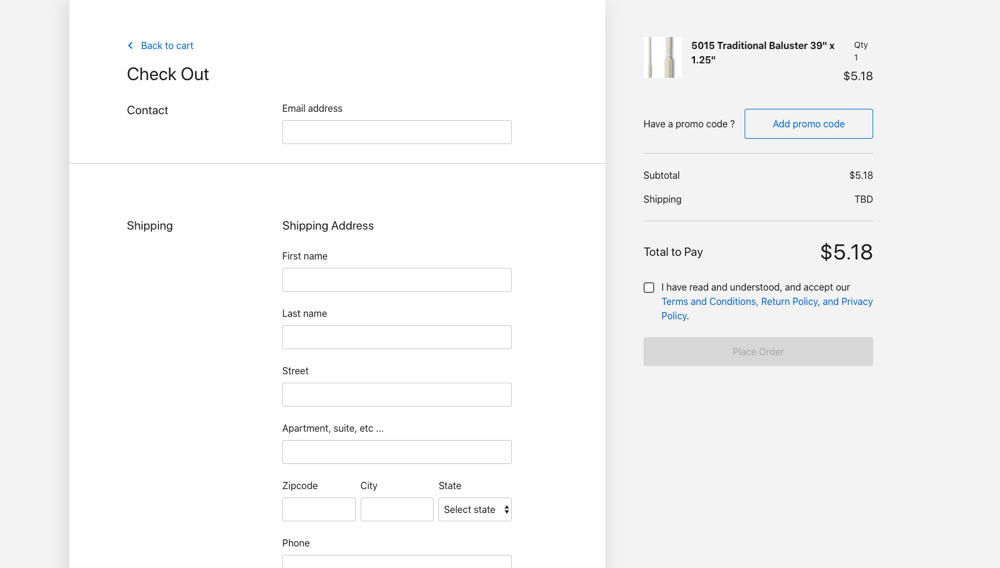
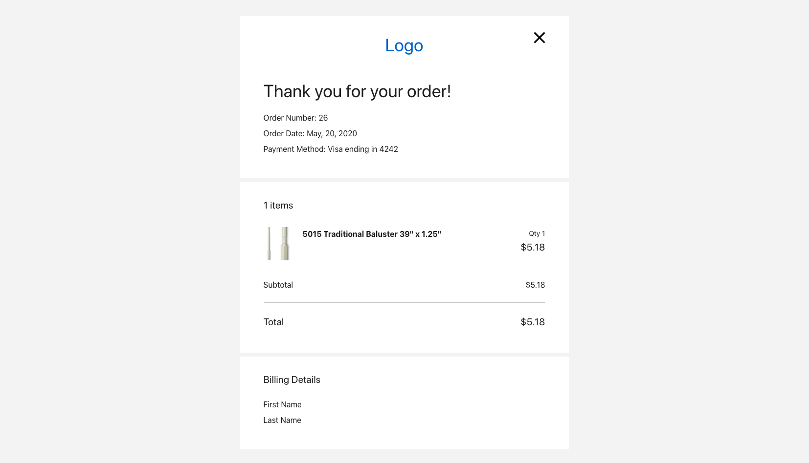
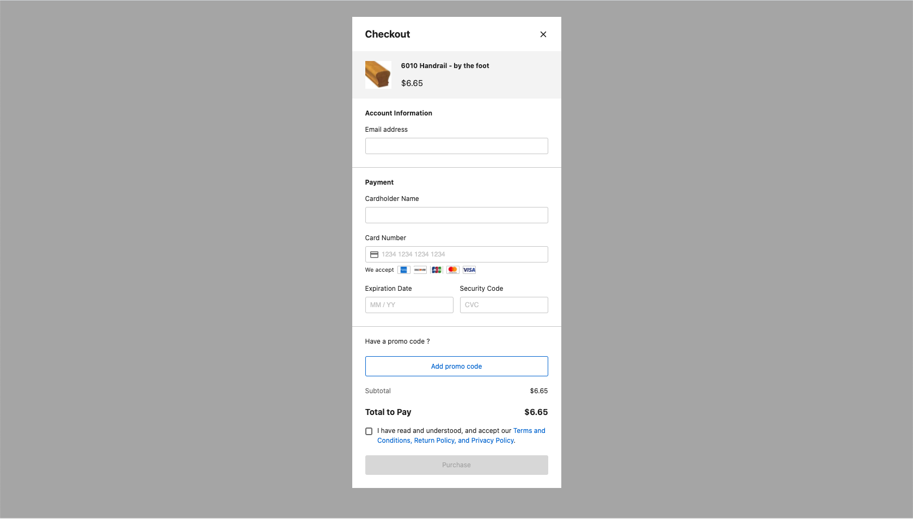

# Components

## R64Cart


R64Cart allows us to see current cart items with items subtotal. We can edit their quantity and leave note for each of them or for the whole cart. From here we can either close the cart (X) or transition to [Checkout](/components#checkout).

### Example

```html
<R64Cart @cart:update="updateCart" />
```

When `R64Cart` component is [mounted](https://vuejs.org/v2/api/#mounted) new cart is automatically created for us and is passed to parent with `@cart:update` event. If you want to re-use cart that has already been created, you can pass in `cart-token` using props.

```html
<R64Cart
  :cart-token="cartToken"
  @cart:update="updateCart"
/>
```

### Events
| Event | Payload           | Description |
| ----- | ----------------- | ----- |
| cart:update | cart object | Triggered for every cart update|
| close       |      -      | Triggered on cart close (X) |
| checkout    |      -      | Triggered when clicking on Checkout button |

### Props
| Property        | Type    | Default value |
| --------------- | ------- | ------------- |
| cart-token      | String  | null          |
| currency-symbol | String  | $             |

In addition `R64Cart` component also accepts [Theme props](/theme).

### Real world example part 1
Here we'll gradually build the whole checkout flow using `R64Cart`, `R64Checkout` and `R64Order` components. Jump to [final part](/components#real-world-example-part-3) to see the whole flow.
This part of example outlines how to use `R64Cart` component and `cartApi` with [localStorage](https://developer.mozilla.org/en-US/docs/Web/API/Window/localStorage).

```vue
<template>
  <R64Cart
    v-if="cart"
    :cart-token="cartToken"
    @cart:update="updateCart"
  />
</template>

<script>
import { R64Cart, cartApi } from '@64robots/checkout-vue'

export default {
  data() {
    return {
      cart: null,
    }
  },

  computed: {
    cartToken() {
      return this.cart && this.cart.cart_token
    },
  },
  
  async mounted() {
    const cartToken = window.localStorage.getItem('cart_token')

    try {
      if (!cartToken) {
        const { data } = await cartApi.create()
        window.localStorage.setItem('cart_token', data.cart_token)
        this.cart = data
      } else {
        const { data } = await cartApi.get(cartToken)
        this.cart = data
      }
    } catch (e) {
      //
    }
  },

  methods: {
    updateCart(cart) { 
      this.cart = cart
    }
  },
}
</script>
```

## R64Checkout



R64Checkout component contains all the typical checkout form items such as **contact**, **,shipping**,, **,billing**, (optional) and **,payment**, information. We can toggle between same and different billing address and apply **,coupons**,. R64Checkout can be extended with `options` slot that allows us to get some final information from users before placing the order. From checkout we can either go back to cart or place an order.

### Example

```html
<R64Checkout
  :cart-token="cartToken"
  :settings="settings"
  :stripe-key="stripeKey"
  @order:create="orderCreate"
/>
```

### Events
| Event        | Payload            | Description                     |
| ------------ | ------------------ | ------------------------------- |
| order:create | order object | Triggered after successfully placing the order|
| cart:update  | cart object  | Triggered for every cart update |
| cart         |      -       | Triggered when clicking on **Back to cart** |

### Props
| Property        | Type    | Default value |
| --------------- | ------- | ------------- |
| cart-token      | String  | null          |
| settings        | Object  | null          |
| currency-symbol | String  | $             |
| stripe-key      | String  | null          |

In addition `R64Checkout` component also accepts [Theme props](/theme).

### Real world example part 2
This example outlines how to use `R64Checkout` together with `R64Cart`, `cartApi` and [localStorage](https://developer.mozilla.org/en-US/docs/Web/API/Window/localStorage).

```vue
<template>
  <div>
    <R64Cart
      v-if="section === 'cart'"
      :cart-token="cartToken"
      @cart:update="updateCart"
      @close="hide"
      @checkout="show('checkout')"
    />

    <R64Checkout
      v-if="section === 'checkout'"
      :cart-token="cartToken"
      :settings="settings"
      :stripe-key="stripeKey"
      @order:create="orderCreate"
      @cart="show('cart')"
    />
  </div>
</template>

<script>
import { R64Cart, R64Checkout, cartApi, checkoutApi } from '@64robots/checkout-vue'

export default {
  data() {
    return {
      section: null,
      settings: null,
      cart: null,
    }
  },

  computed: {
    cartToken() {
      return this.cart && this.cart.cart_token
    },

    stripeKey() {
      // write your stripe key directly here or from .env file
      return process.env.STRIPE_KEY
    },
  },
  
  async mounted() {
    const cartToken = window.localStorage.getItem('cart_token')

    try {
      const { data } = await checkoutApi.settings()
      this.settings = data

      if (!cartToken) {
        const { data } = await cartApi.create()
        window.localStorage.setItem('cart_token', data.cart_token)
        this.cart = data
      } else {
        const { data } = await cartApi.get(cartToken)
        this.cart = data
      }

      this.section = 'cart'
    } catch (e) {
      //
    }
  },

  methods: {
    updateCart(cart) { 
      this.cart = cart
    },

    hide() {
      this.section = null
    },

    show(section) {
      this.section = section
    },

    orderCreate(order) {
      // Do something with order here
    },
  },
}
</script>
```

## R64Order



R64Order component shows order details with order items, subtotal, discount, shipping, tax and checkout information. We can provide custom logo using `logo` props and toggle **shipping** and **billing** information. We can close this component (trigger close event) by clicking on X.

### Example

```html
<R64Order
  with-shipping
  with-billing
  :order-token="orderToken"
  @close="hide"
/>
```

### Events
| Event        | Payload            | Description                     |
| ------------ | ------------------ | ------------------------------- |
| order:get    | order object | Triggered after component had fetched order using order-token |
| close        |      -       | Triggered when clicking on X |

### Props
| Property        | Type    | Default value |
| --------------- | ------- | ------------- |
| order-token     | String  | null          |
| currency-symbol | String  | $             |

In addition `R64Order` component also accepts [Theme props](/theme).

### Real world example part 3
This example outlines how to use all 3 components together to build the whole checkout flow with [localStorage](https://developer.mozilla.org/en-US/docs/Web/API/Window/localStorage).

```vue
<template>
  <div>
    <R64Cart
      v-if="section === 'cart'"
      :cart-token="cartToken"
      @cart:update="updateCart"
      @close="hide"
      @checkout="show('checkout')"
    />

    <R64Checkout
      v-if="section === 'checkout'"
      :cart-token="cartToken"
      :settings="settings"
      :stripe-key="stripeKey"
      @order:create="orderCreate"
      @cart="show('cart')"
    />

    <R64Order
      v-if="section === 'order'"
      :order-token="orderToken"
      @close="hide"
    />
  </div>
</template>

<script>
import { R64Cart, R64Checkout, R64Order, cartApi, checkoutApi } from '@64robots/checkout-vue'

export default {
  data() {
    return {
      section: null,
      settings: null,
      cart: null,
    }
  },

  computed: {
    cartToken() {
      return this.cart && this.cart.cart_token
    },

    orderToken() {
      return this.order && this.order.token
    },

    stripeKey() {
      // write your stripe key directly here or from .env file
      return process.env.STRIPE_KEY
    },
  },
  
  async mounted() {
    const cartToken = window.localStorage.getItem('cart_token')

    try {
      const { data } = await checkoutApi.settings()
      this.settings = data

      if (!cartToken) {
        const { data } = await cartApi.create()
        window.localStorage.setItem('cart_token', data.cart_token)
        this.cart = data
      } else {
        const { data } = await cartApi.get(cartToken)
        this.cart = data
      }

      this.section = 'cart'
    } catch (e) {
      //
    }
  },

  methods: {
    updateCart(cart) { 
      this.cart = cart
    },

    hide() {
      this.section = null
    },

    show(section) {
      this.section = section
    },

    orderCreate(order) {
      this.order = order
      this.section = 'order'
    },
  },
}
</script>
```

## R64SingleItemCheckout




R64SingleItemCheckout component is handy when we only need to checkout 1 item without any specific shipping details (selling courses, e-books, donations ...). We can toggle coupons using `with-coupons` prop or close this component (trigger close event) by clicking on X.

### Example

```html
<R64SingleItemCheckout
  with-coupons
  :cart-token="cartToken"
  :settings="settings"
  :stripe-key="stripeKey"
  @cart:update="cartUpdate"
  @close="hide"
  @order:create="orderCreate"
/>
```

### Events
| Event        | Payload            | Description                     |
| ------------ | ------------------ | ------------------------------- |
| order:create | order object | Triggered after successfully placing the order|
| cart:update  | cart object  | Triggered for every cart update |
| close        |      -       | Triggered when clicking on X |

### Props
| Property        | Type    | Default value |
| --------------- | ------- | ------------- |
| cart-token      | String  | null          |
| settings        | Object  | null          |
| currency-symbol | String  | $             |
| stripe-key      | String  | null          |
| with-coupons    | Boolean | false         |

In addition `R64SingleItemCheckout` component also accepts [Theme props](/theme).

### Real world example
This example outlines how to use `R64SingleItemCheckout` and `R64Order` to build single item checkout with [localStorage](https://developer.mozilla.org/en-US/docs/Web/API/Window/localStorage).

```vue
<template>
  <div>
    <R64SingleItemCheckout
      v-if="section === 'checkout'"
      with-coupons
      :cart-token="cartToken"
      :settings="settings"
      :stripe-key="stripeKey"
      @cart:update="updateCart"
      @close="hide"
      @order:create="orderCreate"
    />

    <R64Order
      v-if="section === 'order'"
      :order-token="orderToken"
      @close="hide"
    />
  </div>
</template>

<script>
import { 
  R64Cart, 
  R64Checkout, 
  R64Order, 
  cartApi, 
  checkoutApi
 } from '@64robots/checkout-vue'

export default {
  data() {
    return {
      section: null,
      settings: null,
      cart: null,
    }
  },

  computed: {
    cartToken() {
      return this.cart && this.cart.cart_token
    },

    orderToken() {
      return this.order && this.order.token
    },

    stripeKey() {
      // write your stripe key directly here or from .env file
      return process.env.STRIPE_KEY
    },
  },
  
  async mounted() {
    const cartToken = window.localStorage.getItem('cart_token')

    try {
      const { data } = await checkoutApi.settings()
      this.settings = data

      if (!cartToken) {
        const { data } = await cartApi.create()
        window.localStorage.setItem('cart_token', data.cart_token)
        this.cart = data
      } else {
        const { data } = await cartApi.get(cartToken)
        this.cart = data
      }

      this.section = 'checkout'
    } catch (e) {
      //
    }
  },

  methods: {
    updateCart(cart) { 
      this.cart = cart
    },

    hide() {
      this.section = null
    },

    show(section) {
      this.section = section
    },

    orderCreate(order) {
      this.order = order
      this.section = 'order'
    },
  },
}
</script>
```